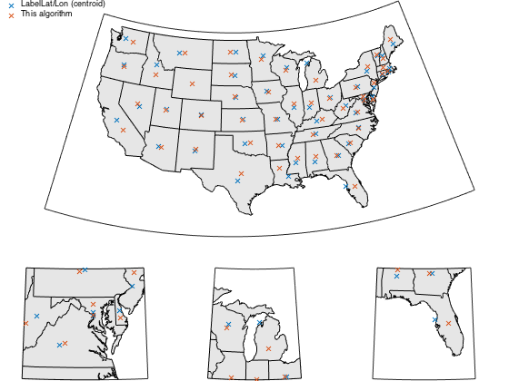

## `polygonlabel.m` Documentation

This function was designed to label convex polygons on a map, where you
want to find a nice open space within the polygon to place a label.  The
"best" place to label often isn't the centroid of the polygon.

This is designed to be used with cartesian coordinate polygons; project
map polygons prior to calling.  For very complex polygons, I recommend
reducing the number of vertices prior to calling this function, since
extra vertices can increase computation time significantly.

The underlying algorithm is based on Kang & Elhami, 2001, ("Using
Shape Analyses for Placement of Polygon Labels", ESRI 2001 Int. User
Conf), found [here](http://proceedings.esri.com/library/userconf/proc01/professional/papers/pap388/p388.htm).

### Syntax

```
[xl,yl] = polygonlabel(x, y)
```

See function help for description of input and output variables

### Example

For our example, we'll use the USA states shapefile from the Mapping Toolbox.

```matlab
S = shaperead('usastatelo', ...
    'UseGeoCoords', true,...
    'Selector', {@(name) ~any(strcmp(name,{'Alaska','Hawaii'})), 'Name'});
```

I start by setting up map axes: one for the full continental US, and 3 
subplots zooming in on some geometrically complex, harder-to-label states.

```matlab
figure('color', 'w');
ax(2) = axes('position', [0   0   1/3 0.3]);
ax(3) = axes('position', [1/3 0   1/3 0.3]);
ax(4) = axes('position', [2/3 0   1/3 0.3]);

ax(1) = usamap('conus');
set(ax(1), 'position', [0   0.3 1   0.7]);

axes(ax(2));
usamap('Maryland');
axes(ax(3));
usamap('Michigan');
axes(ax(4));
usamap('Florida');

arrayfun(@(x) geoshow(x, S, ...
    'DisplayType', 'polygon', ...
    'facecolor', ones(1,3)*0.9), ax);

arrayfun(@(ax) setm(ax, ...
    'grid', 'off', ...
    'meridianlabel', 'off', ...
    'parallellabel', 'off', ...
    'flinewidth', 1), ax)
```

Now we can calculate label positions for each state using `polygonlabel`, 
and compare this to the label locations prescribed by the shapefile itself
(which correspond to the centroids of each polygon).

```matlab
nstate = numel(S);

[lnlbl, ltlbl] = deal(nan(nstate,2));
lnlbl(:,1) = [S.LabelLon];
ltlbl(:,1) = [S.LabelLat];

axes(ax(1)); % reference for mfwdtran/minvtran

for ii = 1:numel(S)
    [x,y] = mfwdtran(S(ii).Lat(1:end-1), S(ii).Lon(1:end-1));
    [xl,yl] = polygonlabel(x,y);
    [ltlbl(ii,2), lnlbl(ii,2)] = minvtran(xl, yl);
end

lbl = plotm(ltlbl, lnlbl, 'x', 'parent', ax(1));
plotm(ltlbl, lnlbl, 'x', 'parent', ax(2));
plotm(ltlbl, lnlbl, 'x', 'parent', ax(3));
plotm(ltlbl, lnlbl, 'x', 'parent', ax(4));

legendflex(lbl, {'LabelLat/Lon (centroid)', 'This algorithm'}, ...
    'ref', ax(1), 'buffer', [0 0],'anchor', {'nw','nw'}, 'box', 'off', ...
    'xscale', 0.5);	
```

